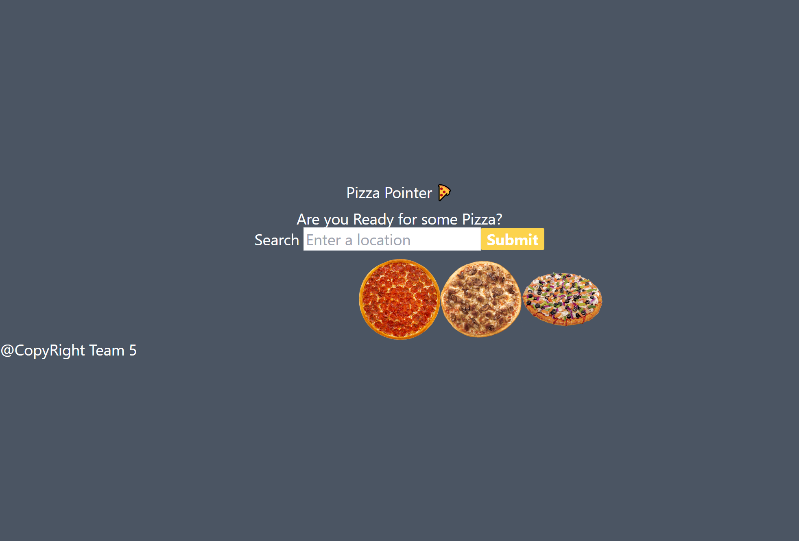

# Pizza Pointer

## Description

We were motivated to create an application that was a simple and concise method to find locations that sold pizza.
It was built for the pizza lovers out there that want to waste no time when finding the right spot to eat.
While engineering this project it was crucial that we did our research on our Third Party assets, such as Google, and OpenWeatherMap, by reviewing their documentation carefully to solve the issues that were occurring in the early stages of development. We learned its best to read up on what we were using but to also experiment with it to fully understand its capabilities.

## ScreenShot

## Link to Site

https://midasantiago.github.io/pizza-pointer/

## Credits

Collaborators:
- https://github.com/Maestro-Smooovo
- https://github.com/mostafaelgazayrli

Third Party Assets:
- CSS Library: https://tailwindcss.com/docs/installation
- Google API: https://developers.google.com/maps/documentation/places/web-service/overview
- OpenWeatherAPI: https://openweathermap.org/api/geocoding-api
